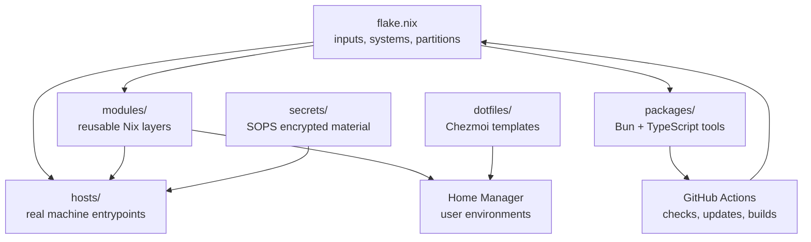

<div align="center">
  <picture>
    <source
      media="(prefers-color-scheme: dark)"
      srcset="https://raw.githubusercontent.com/catppuccin/catppuccin/main/assets/palette/macchiato.png"
    />
    
  </picture>

  <h1>EUVlok</h1>

  <p>
    <strong>A communal Nix flake where friends share systems, homes, dotfiles, and the little tools that keep them moving.</strong>
  </p>

  <p>
    <a href="#quick-start">Quick Start</a>
    ·
    <a href="#the-shape">The Shape</a>
    ·
    <a href="#communal-pulse">Communal Pulse</a>
    ·
    <a href="#host-map">Host Map</a>
    ·
    <a href="#signal-paths">Signal Paths</a>
    ·
    <a href="#published-flake-outputs">Flake Outputs</a>
    ·
    <a href="#working-here">Working Here</a>
  </p>

  <p>
    <a href="https://github.com/euvlok/euvlok/actions/workflows/ci.yml">
      
    </a>
    <a href="https://github.com/euvlok/euvlok/stargazers">
      
    </a>
    <a href="https://github.com/euvlok/euvlok/issues">
      
    </a>
    <a href="https://github.com/euvlok/euvlok">
      
    </a>
  </p>

  <p>
    
    
    
    
    
  </p>

  <p>
    <sub>built like a shared notebook, maintained like infrastructure, used like home</sub>
  </p>
</div>

---

<table align="center">
  <tr>
    <th>shared flake</th>
    <th>friend atlas</th>
    <th>home commons</th>
    <th>tool shed</th>
  </tr>
  <tr>
    <td><code>flake-parts</code>, pinned inputs, and one place to compare ideas.</td>
    <td>NixOS and nix-darwin machines shaped by the people who use them.</td>
    <td>Home Manager modules plus Chezmoi files worth borrowing from each other.</td>
    <td>Bun/TypeScript helpers for the chores nobody should repeat alone.</td>
  </tr>
</table>

## Why This Exists

EUVlok is where a few friends keep their machines understandable together. It
started from a simple itch: we were already talking about Nix, trading programs,
and peeking into each other's dotfiles, so keeping those discoveries scattered
across separate repositories felt slower than the friendship itself.

The name is half European Union, half Dutch: `EU` for the European Union and
`vlok` for "flake." The Dutch nod is intentional; Nix began in the Netherlands,
and this repo is very much in that lineage of declarative systems, careful
composition, and the occasional strongly held opinion about a shell prompt.

This repository is not a pristine starter template. It is a working garden of
real machines, real habits, and shared abstractions that have survived contact
with daily use. The goal is to make personal infrastructure easier to inspect,
borrow from, improve, and repair together.

We like the communal shape of it: one person finds a better shell trick, another
turns it into a module, someone else stress-tests it on a completely different
host, and eventually the useful parts become shared ground. EUVlok is a place
for that loop to happen in the open.

> [!NOTE]
> EUVlok is a living configuration repo. Treat it as a map of useful patterns,
> not a drop-in installer for someone else's machine.

> [!IMPORTANT]
> Files under [`secrets/`](./secrets) are SOPS-encrypted and intentionally live
> beside the hosts that consume them.

<details open>
<summary><strong>What this is / what this is not</strong></summary>

| This repo is...                                                   | This repo is not...                                              |
| ----------------------------------------------------------------- | ---------------------------------------------------------------- |
| A shared operating base for real daily machines and real friends. | A generic one-command installer.                                 |
| A library of reusable Nix, Home Manager, and dotfile patterns.    | A promise that every host fits every laptop, desktop, or server. |
| A place where experiments become modules once they prove useful.  | A museum of perfectly neutral defaults.                          |
| A small automation workshop for the repetitive parts of upkeep.   | A replacement for reading the code before adopting it.           |

</details>

## Shared Rituals

<table>
  <tr>
    <th>Ritual</th>
    <th>Why it matters</th>
    <th>Where it tends to land</th>
  </tr>
  <tr>
    <td><strong>Bring a finding</strong></td>
    <td>Someone discovers a tool, option, workflow, or weird fix worth trying.</td>
    <td><a href="./hosts">hosts</a>, first, while it still belongs to one person's machine.</td>
  </tr>
  <tr>
    <td><strong>Make it legible</strong></td>
    <td>The useful part gets named, split out, and made easier for another friend to read.</td>
    <td><a href="./modules">modules</a> or <a href="./lib">lib</a>, once the pattern is real.</td>
  </tr>
  <tr>
    <td><strong>Share the boring work</strong></td>
    <td>Updates, prefetches, checks, and workflow chores should not be hand-rolled five times.</td>
    <td><a href="./packages">packages</a>, <a href="./scripts">scripts</a>, and CI.</td>
  </tr>
  <tr>
    <td><strong>Keep the taste visible</strong></td>
    <td>Personal configuration is allowed to be personal; that is what makes it worth borrowing from.</td>
    <td><a href="./dotfiles">dotfiles</a> and owner-specific Home Manager files.</td>
  </tr>
</table>

## What Is Inside

| Path                                | Purpose                                                                                          |
| ----------------------------------- | ------------------------------------------------------------------------------------------------ |
| [`flake.nix`](./flake.nix)          | Top-level flake inputs, partitions, systems, and shared output wiring.                           |
| [`flake-modules/`](./flake-modules) | Flake-parts modules for packages, exported modules, users, checks, and the development shell.    |
| [`hosts/`](./hosts)                 | NixOS, nix-darwin, and Home Manager entrypoints for the machines friends actually use.           |
| [`modules/`](./modules)             | Reusable modules grown from shared habits, experiments, and hard-won preferences.                |
| [`dotfiles/`](./dotfiles)           | Chezmoi dotfiles and templates that make personal taste easy to inspect and borrow from.         |
| [`lib/`](./lib)                     | Shared Nix helpers for Catppuccin, Ghostty, Kanata, Yazi, Zellij, and general module ergonomics. |
| [`packages/`](./packages)           | Bun-powered automation packages and TypeScript utilities for shared maintenance work.            |
| [`scripts/`](./scripts)             | Repository and GitHub workflow automation scripts.                                               |
| [`secrets/`](./secrets)             | SOPS-encrypted host and user secrets.                                                            |

## The Shape



<p align="center">
  <strong>One flake, several friends, many machines, fewer mysteries.</strong>
</p>

## Communal Pulse

<table>
  <tr>
    <th>We share because...</th>
    <th>That looks like...</th>
  </tr>
  <tr>
    <td>Good dotfiles are easier to understand when you can ask the person who wrote them.</td>
    <td>Hosts and homes stay close to their owners, but the useful pieces graduate into shared modules.</td>
  </tr>
  <tr>
    <td>Nix rewards careful composition, and careful composition gets better with more than one pair of eyes.</td>
    <td>One person's experiment can become another person's default after it proves itself.</td>
  </tr>
  <tr>
    <td>The wider Nix community taught us by making its work public.</td>
    <td>We keep EUVlok public so our own patterns, mistakes, and small wins can be useful too.</td>
  </tr>
</table>

<blockquote>
  <p>
    <strong>Open hands, open code.</strong> Most of what lives here began as a
    conversation: "look what I found," "try this module," "your config does that
    better," "wait, we should make this reusable."
  </p>
</blockquote>

## Component Matrix

| Layer    | Shared pieces                                                                   | Personal pieces                                                 | First place to inspect    |
| -------- | ------------------------------------------------------------------------------- | --------------------------------------------------------------- | ------------------------- |
| Systems  | Cross-platform Nix defaults, package policy, secrets wiring.                    | Hardware, boot, desktop, networking, and host services.         | [`hosts/`](./hosts)       |
| Homes    | Home Manager module bases for shells, terminals, editors, services, and themes. | Git identity, application taste, keybindings, desktop workflow. | [`hosts/hm/`](./hosts/hm) |
| Dotfiles | Chezmoi templates, scripts, and reusable user-space conventions.                | Files that should stay close to a particular person or machine. | [`dotfiles/`](./dotfiles) |
| Tooling  | Bun CLIs, workflow checks, update scripts, shared TypeScript helpers.           | One-off experiments before they earn a reusable interface.      | [`packages/`](./packages) |

## Quick Start

<table>
  <tr>
    <th>I want to...</th>
    <th>Run this</th>
  </tr>
  <tr>
    <td>Enter the development shell</td>
    <td>
      <pre><code>nix develop</code></pre>
    </td>
  </tr>
  <tr>
    <td>Build a NixOS host</td>
    <td>
      <pre><code>nix build .#nixosConfigurations.nyx.config.system.build.toplevel</code></pre>
    </td>
  </tr>
  <tr>
    <td>Build a nix-darwin host</td>
    <td>
      <pre><code>nix build .#darwinConfigurations.FlameFlags-Mac-mini.system</code></pre>
    </td>
  </tr>
  <tr>
    <td>Inspect a standalone Home Manager config</td>
    <td>
      <pre><code>nix eval .#homeConfigurations.bigshaq9999.config.home.username</code></pre>
    </td>
  </tr>
  <tr>
    <td>Run a local automation tool</td>
    <td>
      <pre><code>nix run .#auto-rebase</code></pre>
    </td>
  </tr>
</table>

## Host Map

| Output                | Owner           | Platform   | Entrypoint                                                                                                       |
| --------------------- | --------------- | ---------- | ---------------------------------------------------------------------------------------------------------------- |
| `blind-faith`         | `lay-by`        | NixOS      | [`hosts/linux/lay-by/hushh/default.nix`](./hosts/linux/lay-by/hushh/default.nix)                                 |
| `nanachi`             | `bigshaq9999`   | NixOS      | [`hosts/linux/bigshaq9999/nanachi/default.nix`](./hosts/linux/bigshaq9999/nanachi/default.nix)                   |
| `null`                | `sm-idk`        | NixOS      | [`hosts/linux/sm-idk/null/hosts/null/default.nix`](./hosts/linux/sm-idk/null/hosts/null/default.nix)                                       |
| `nyx`                 | `flameflag`     | NixOS      | [`hosts/linux/flameflag/nyx/default.nix`](./hosts/linux/flameflag/nyx/default.nix)                               |
| `unsigned-int16`      | `ashuramaruzxc` | NixOS      | [`hosts/linux/ashuramaruzxc/unsigned-int16/default.nix`](./hosts/linux/ashuramaruzxc/unsigned-int16/default.nix) |
| `unsigned-int32`      | `ashuramaruzxc` | NixOS      | [`hosts/linux/ashuramaruzxc/unsigned-int32/default.nix`](./hosts/linux/ashuramaruzxc/unsigned-int32/default.nix) |
| `unsigned-int64`      | `ashuramaruzxc` | NixOS      | [`hosts/linux/ashuramaruzxc/unsigned-int64/default.nix`](./hosts/linux/ashuramaruzxc/unsigned-int64/default.nix) |
| `FlameFlags-Mac-mini` | `flameflag`     | nix-darwin | [`hosts/darwin/flameflag/flame/default.nix`](./hosts/darwin/flameflag/flame/default.nix)                         |
| `faputa`              | `bigshaq9999`   | nix-darwin | [`hosts/darwin/bigshaq9999/nanachi/default.nix`](./hosts/darwin/bigshaq9999/nanachi/default.nix)                 |
| `unsigned-int8`       | `ashuramaruzxc` | nix-darwin | [`hosts/darwin/ashuramaruzxc/unsigned-int8/default.nix`](./hosts/darwin/ashuramaruzxc/unsigned-int8/default.nix) |

Standalone Home Manager outputs are exposed for `ashuramaruzxc`, `bigshaq9999`,
`lay-by`, and `sm-idk`.

## Signal Paths

<table>
  <tr>
    <th>For module readers</th>
    <th>For host spelunking</th>
    <th>For dotfile borrowing</th>
    <th>For automation work</th>
  </tr>
  <tr>
    <td>Start in <a href="./modules">modules</a>, then follow imports into the places where friends reuse them.</td>
    <td>Pick a row from the host map and read its <code>default.nix</code> outward into the owner's preferences.</td>
    <td>Browse <a href="./dotfiles">dotfiles</a> for Chezmoi templates, personal taste, and settings worth trying.</td>
    <td>Use <a href="./packages">packages</a> and <a href="./scripts">scripts</a> to see how we avoid repeating upkeep by hand.</td>
  </tr>
</table>

## Published Flake Outputs

<details open>
<summary><strong>Modules</strong></summary>

```nix
inputs.euvlok.nixosModules.default
inputs.euvlok.darwinModules.default
inputs.euvlok.homeModules.default
inputs.euvlok.homeModules.os
```

The same modules are also exposed under `flake.modules` for newer consumers.

</details>

<details>
<summary><strong>Configurations</strong></summary>

```text
nixosConfigurations:
  blind-faith
  nanachi
  null
  nyx
  unsigned-int8
  unsigned-int16
  unsigned-int32
  unsigned-int64

darwinConfigurations:
  FlameFlags-Mac-mini
  faputa
  unsigned-int8

homeConfigurations:
  ashuramaruzxc
  bigshaq9999
  lay-by
  sm-idk
```

</details>

<details>
<summary><strong>Apps and packages</strong></summary>

```text
auto-rebase
browser-extension-update
nvidia-prefetch
```

Each package is also exposed as a flake app, so it can be run with
`nix run .#auto-rebase`, `nix run .#browser-extension-update`, or
`nix run .#nvidia-prefetch`.

</details>

## Working Here

Enter the development environment:

```sh
nix develop
```

Install JavaScript dependencies when needed:

```sh
bun install
```

Run the main checks:

```sh
bun run check
bun test
```

Format the TypeScript workspace:

```sh
bun run format
```

Format Nix files through the flake formatter:

```sh
nix fmt
```

## Common Operations

Build or inspect a host:

```sh
nix build .#nixosConfigurations.nyx.config.system.build.toplevel
nix build .#darwinConfigurations.FlameFlags-Mac-mini.system
```

Run one of the local automation tools:

```sh
nix run .#auto-rebase
nix run .#browser-extension-update
nix run .#nvidia-prefetch
```

Work directly with the Bun scripts:

```sh
bun run github:check-workflows
bun run github:lint-workflows
bun run github:update-browser-extensions
bun run github:update-custom-packages
bun run github:update-trivial-flake-inputs
```

## Design Notes

EUVlok is built around a few preferences:

- Keep host files thin and push reusable behavior into modules.
- Let personal taste stay visible while shared defaults become easy to reuse.
- Prefer settings that friends can explain to each other later.
- Treat automations as source code, with tests where the behavior can drift.
- Prefer explicit flake outputs over undocumented local conventions.
- Keep secrets encrypted and close to the configurations that consume them.

## Borrowed Moves

While polishing this README, we looked at a few strong GitHub READMEs and kept
the moves that fit EUVlok:

| Move                          | Why it works here                                                                 |
| ----------------------------- | --------------------------------------------------------------------------------- |
| Button-like README navigation | Makes a long README feel more like a dashboard than a scroll.                     |
| Scope tables                  | Helps readers understand what to copy and what to leave alone.                    |
| Component matrices            | Shows how system, home, dotfile, and tooling layers relate.                       |
| Friendly warnings             | Keeps the repo welcoming without pretending personal infrastructure is universal. |

<details>
<summary><strong>Borrowing from EUVlok</strong></summary>

The best way to copy from this repo is to copy slowly:

1. Start with a module or small helper that solves one problem.
2. Read the host that consumes it and notice whose taste shaped it.
3. Check which inputs, secrets, or user assumptions it carries with it.
4. Adapt the idea into your own configuration instead of importing a mystery.
5. If you improve it, share the better version back with someone.

</details>

## Useful Nix Resources

| Resource                                                           | Why it is useful                                                                 |
| ------------------------------------------------------------------ | -------------------------------------------------------------------------------- |
| [nix.dev](https://nix.dev/)                                        | The best general-purpose on-ramp for modern Nix.                                 |
| [NixOS Wiki](https://wiki.nixos.org/wiki/NixOS_Wiki)               | Practical notes for services, hardware, and day-to-day system work.              |
| [Nixpkgs](https://github.com/NixOS/nixpkgs)                        | The source of truth for packages, modules, and patterns worth copying carefully. |
| [Nixpkgs manual](https://nixos.org/manual/nixpkgs/stable/)         | Package, override, and library documentation.                                    |
| [Home Manager options](https://home-manager-options.extranix.com/) | Searchable Home Manager option reference.                                        |
| [Noogle](https://noogle.dev/)                                      | Search for Nix functions and examples.                                           |
| [Devenv](https://devenv.sh/)                                       | Reproducible development shells with a friendly interface.                       |

## Credits

This repo borrows ideas, patterns, and taste from the wider Nix community. It
also uses the Catppuccin palette and footer art; see the
[Catppuccin project](https://github.com/catppuccin/catppuccin) for licensing
and assets.

<p align="center">
  
</p>
